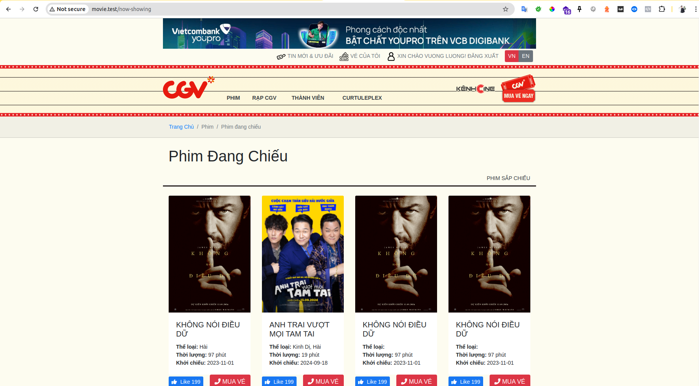
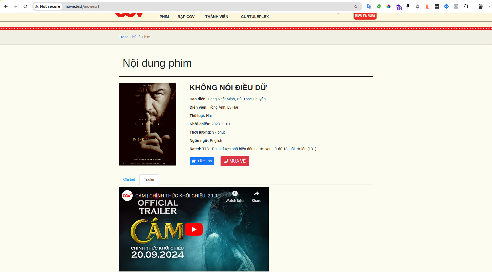
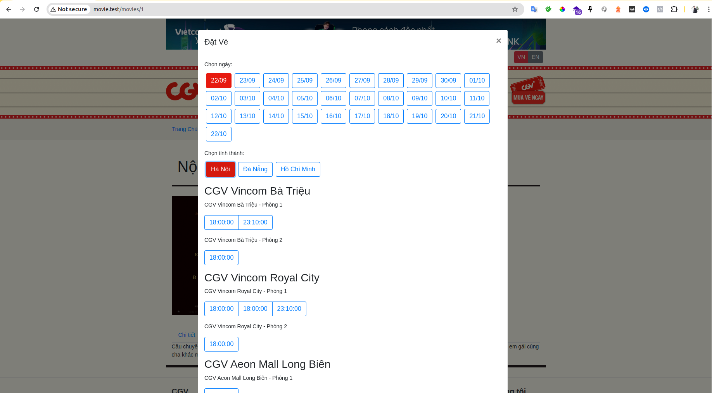
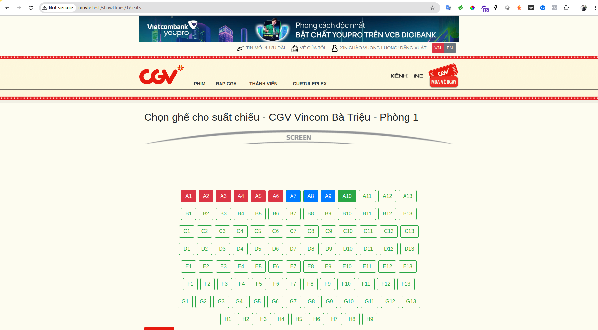
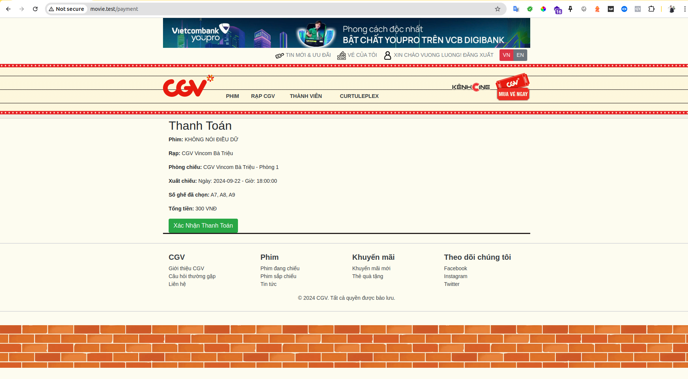
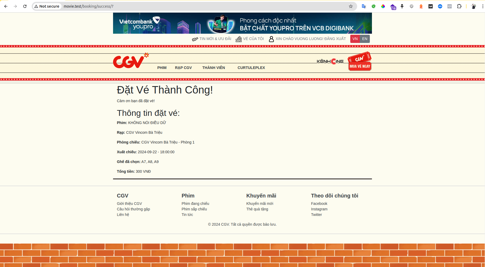
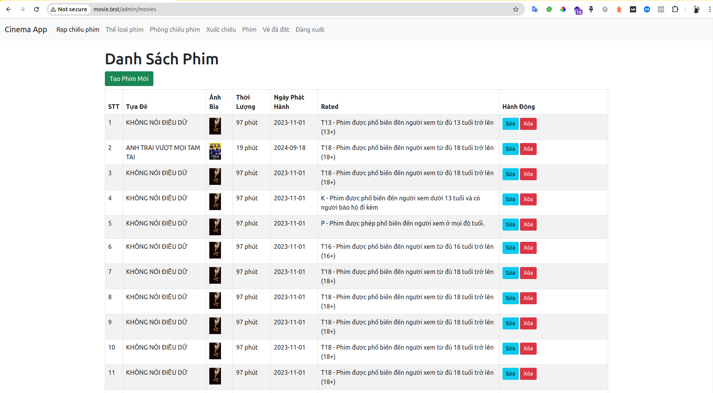
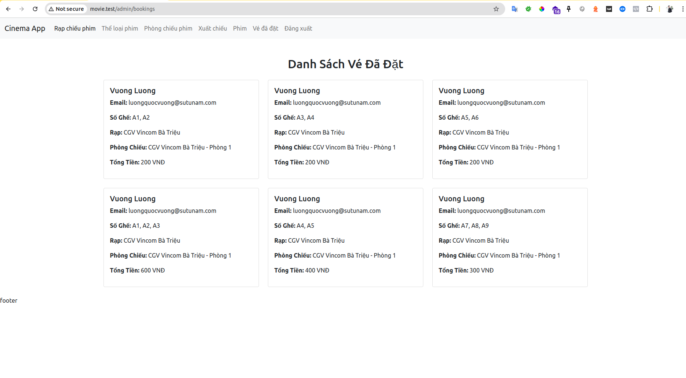

# Ứng Dụng Đặt Vé Xem Phim

## Giới Thiệu
Ứng dụng này cho phép người dùng đặt vé xem phim một cách dễ dàng và nhanh chóng. Người dùng có thể chọn phim, ghế ngồi và thực hiện thanh toán trực tuyến.

## Bước 1: Cài Đặt Môi Trường
- Đảm bảo bạn đã cài đặt [PHP](https://www.php.net/downloads) (phiên bản 8.0 trở lên) và [Composer](https://getcomposer.org/download/).
- Cài đặt [Laravel](https://laravel.com/docs/9.x/installation) bằng Composer.

## Bước 2: Clone Repository
```bash
   git clone https://github.com/vuongxang/movie-app.git
   cd movie-ticket-booking 
   ```

## Bước 3: Cài Đặt Thư Viện
Chạy lệnh sau trong thư mục gốc của dự án:
```bash
composer install
```
## Bước 4: Cấu Hình Ứng Dụng
1. **Tạo file `.env`:**
    - Sao chép file `.env.example` thành `.env`.
    - Cấu hình các thông tin kết nối cơ sở dữ liệu và các thông tin khác trong file `.env`.

2. **Chạy migration:**
```bash
   php artisan migrate
   ```

## Bước 5: Chạy Ứng Dụng
Chạy lệnh sau để khởi động server:
```bash
php artisan serve
   ```
Truy cập ứng dụng tại `http://localhost:8000`.

## Ảnh Giao Diện

- Trang danh sách:
  
- Trang chi tiết phim:
  
- Popup lựa chọn xuất chiếu phim:
  
- Trang lựa chọn vị trí ghế ngồi:
  
- Trang Thanh toán:
  
- Trang đặt vé thành công:
  
- Trang admin quản lý phim:
  
- Trang admin danh sách vé:
  
## Liên Hệ
Nếu bạn có bất kỳ câu hỏi nào, hãy liên hệ với chúng tôi qua email: [luongvuong6458@gmail.com](mailto:luongvuong6458@gmail.com).
